## Introduction

This post is an implementation of the Feature-Based Expected Goals (xG) Model from Section 2.4 of [Jonathan Arsenault](https://www.linkedin.com/in/jonathan-arsenault-a0b414114/)'s [PhD thesis](https://mcgill.scholaris.ca/items/da91938f-30c7-4f75-9ca3-2402a9e5422f). As the thesis puts it, "xG models use a supervised learning algorithm to establish a mapping between a set of features that describe a shot and the probability of the shot resulting in a goal." Here, those features come from event and tracking data and capture shooter location, shooter motion, pressure from defenders, pre-shot puck movement, traffic in the shooting lane, and goaltender positioning. We will create each of these features, then train an XGBoost model to predict each shot's probability of becoming a goal.

We will use data from the [Big Data Cup 2026](https://github.com/bigdatacup/Big-Data-Cup-2026), which spans 10 games and combines Stathletes-tracked event data with player tracking data generated from broadcast video.

 All code is written using Claude Opus 4.8 and verified by the author.


### Data Import

We import the data from the [Big Data Cup 2026 GitHub repository](https://github.com/bigdatacup/Big-Data-Cup-2026/releases/tag/Data) and tag each events and tracking data with a Game ID. Then, we convert the clock strings ("MM:SS" / "M:SS") to total seconds for easier comparison and joining between the events and tracking datasets. The tracking data is separated by period (P1/P2/P3/OT), so we combine all the tracking files into one dataset of every tracked player-frame across all games and periods.  


```{python}
import polars as pl
from great_tables import GT
import math
import json
import urllib.request, io

# Convert clock strings ("MM:SS" / "M:SS") to total seconds.
# events.Clock uses zero-padded minutes ("09:30"); tracking "Game Clock" is unpadded ("9:30").
# Casting both to integer seconds makes them directly comparable for joins.
def clock_to_seconds(col):
    parts = pl.col(col).str.split(":")
    return (
        parts.list.get(0).cast(pl.Int64) * 60
        + parts.list.get(1).cast(pl.Int64)
    )

# Add the seconds column and slot it right after its source column.
def add_seconds_after(df, src, new):
    df = df.with_columns(clock_to_seconds(src).alias(new))
    cols = [c for c in df.columns if c != new]
    cols.insert(df.get_column_index(src) + 1, new)
    return df.select(cols)

# Every game is read directly from the Big Data Cup 2026 release (no local download).
# Each row is tagged with a "Game" id (the filename stem, e.g. "2025-10-11.Team.A.@.Team.D"),
# identical for a game's Events and Tracking files. That key is required downstream: the
# shots<->tracking joins match on Period + Frame, but Frame is only a per-game counter, so
# without "Game" they would cross-match rows between different games.
_RELEASE_API = "https://api.github.com/repos/bigdatacup/Big-Data-Cup-2026/releases/tags/Data"
_assets = {a["name"]: a["browser_download_url"]
           for a in json.load(urllib.request.urlopen(_RELEASE_API))["assets"]}

def _read_url(url, **kwargs):
    return pl.read_csv(io.BytesIO(urllib.request.urlopen(url).read()), **kwargs)

# Events: one file per game.
event_frames = []
for name, url in _assets.items():
    if not name.endswith(".Events.csv"):
        continue
    game = name[: -len(".Events.csv")]
    df = _read_url(url, schema_overrides={"Player_Id": pl.String, "Player_Id_2": pl.String})
    df = add_seconds_after(df, "Clock", "Clock_Seconds")
    df = df.with_columns(pl.lit(game).alias("Game"))
    event_frames.append(df)
events = pl.concat(event_frames)

# Tracking: P1/P2/P3 (+ POT overtime). ".Tracking_P" excludes Shifts and camera_orientations.
track_frames = []
for name, url in _assets.items():
    if ".Tracking_P" not in name:
        continue
    game = name.split(".Tracking_")[0]
    df = _read_url(url, schema_overrides={"Rink Location Z (Feet)": pl.Float64, "Period": pl.String}).drop("Player Id")
    # Overtime tracking labels Period as "OT"; events use 4 for OT. Normalize to 4 (Int64)
    # so the dtype is consistent across files and OT shots can join their tracking frames.
    df = df.with_columns(pl.col("Period").replace("OT", "4").cast(pl.Int64))
    df = add_seconds_after(df, "Game Clock", "Game_Clock_Seconds")
    df = df.with_columns(pl.lit(game).alias("Game"))
    track_frames.append(df)

# One table of every tracked player-frame across all games and periods.
tracking = pl.concat(track_frames)
```

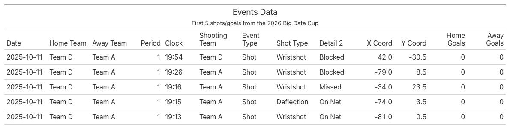

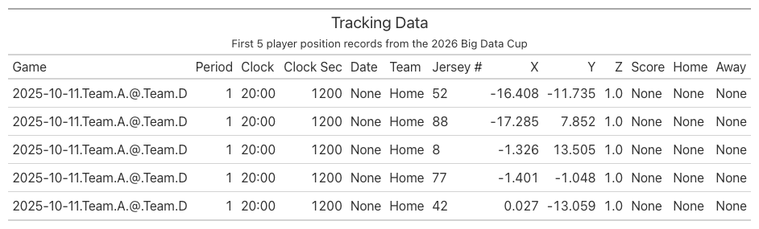


### Distribution of Shot Types

We look at the distribution of shot types in the events dataset. We filter for `Shot` and `Goal` events and count the number of unique occurences of the `Detail 1` column, which indicates the type of shot taken. We then visualize this distribution using a bar chart.

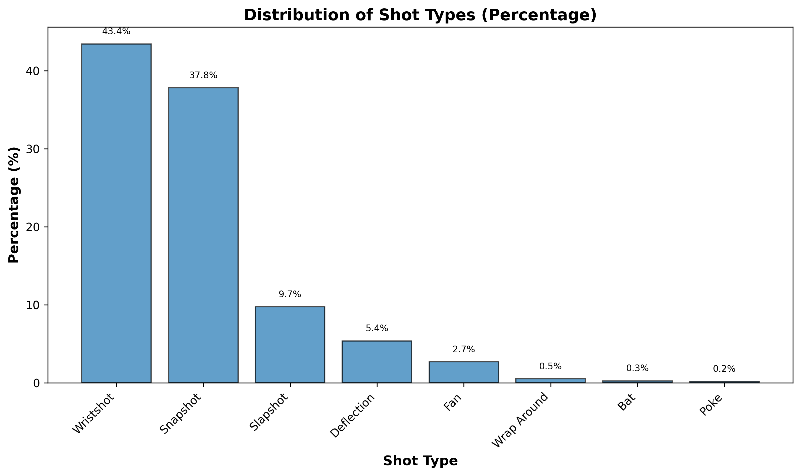

```{python}
shot_types = (
    events.filter(pl.col("Event").is_in(["Shot", "Goal"]))
    .group_by("Detail_1")
    .agg(pl.len().alias("count"))
    .with_columns((pl.col("count") / pl.col("count").sum()).alias("pct"))
    .sort("count", descending=True)
)


import matplotlib.pyplot as plt

fig, ax = plt.subplots(figsize=(10, 6))

# Create bar chart with percentages
ax.bar(shot_types["Detail_1"], shot_types["pct"] * 100, color="#1f77b4", edgecolor="black", alpha=0.7)

# Customize the plot
ax.set_xlabel("Shot Type", fontsize=12, fontweight="bold")
ax.set_ylabel("Percentage (%)", fontsize=12, fontweight="bold")
ax.set_title("Distribution of Shot Types (Percentage)", fontsize=14, fontweight="bold")

# Rotate x-axis labels for better readability
plt.xticks(rotation=45, ha="right")

# Add percentage labels on top of bars
for i, v in enumerate(shot_types["pct"]):
    ax.text(i, v * 100 + 1, f"{v*100:.1f}%", ha="center", va="bottom", fontsize=8)

plt.tight_layout()
plt.show()
```

The shot type distribution in our dataset is very similar to the thesis's dataset. Table 2.1 from the thesis reveals that Wrist Shots (47.8%) and Snap Shots (25.5%) are the most common, followed by Slap Shots (15.6%) and Deflections (4.5%).


### Distribution of Shot Outcomes

We look at the shot outcomes in the events dataset. We filter for `Shot` and `Goal` events and count the number of unique occurences of the `Detail 2` column, which indicates the outcome of the shot (e.g., On Net, Missed, Blocked).

```{python}
descriptions = {
    "Saved": "The shot is on target and saved by the goaltender.",
    "Goal": "The shot is on target and not saved by the goaltender, resulting in a goal.",
    "Blocked": "The shot is blocked by a skater from the defending team.",
    "Missed": "The shot is not on target.",
}

shot_outcomes = (
    events.filter(pl.col("Event").is_in(["Shot", "Goal"]))
    .with_columns(
        pl.when(pl.col("Event") == "Goal")
        .then(pl.lit("Goal"))
        .when((pl.col("Event") == "Shot") & (pl.col("Detail_2") == "On Net"))
        .then(pl.lit("Saved"))
        .when((pl.col("Event") == "Shot") & (pl.col("Detail_2") == "Blocked"))
        .then(pl.lit("Blocked"))
        .when((pl.col("Event") == "Shot") & (pl.col("Detail_2") == "Missed"))
        .then(pl.lit("Missed"))
        .alias("Outcome")
    )
    .group_by("Outcome")
    .agg(pl.len().alias("count"))
    .with_columns((pl.col("count") / pl.col("count").sum()).alias("pct"))
    .with_columns(pl.col("Outcome").replace(descriptions).alias("Description"))
    .select("Outcome", "Description", "pct")
    .sort("pct", descending=True)
)

(
    GT(shot_outcomes)
    .tab_header(title="Distribution of shot outcomes in the dataset")
    .cols_label(
        Outcome="Shot Outcome",
        Description="Description",
        pct="% of Shots",
    )
    .fmt_percent("pct", decimals=1)
    .cols_width({"Outcome": "130px", "Description": "420px", "pct": "110px"})
)
```

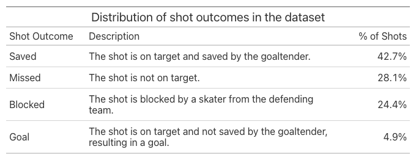

Again, the shot outcome distribution in our dataset is very similar to the thesis's dataset. Table 2.2 from the thesis shows that the Saved outcome is the most common (48.3%), followed by Blocked (26.0%), Missed (21.4%), and Goal (4.21%). It is perfectly normal for the Goal outcome to be the least common, as goals are rare in hockey.

### Distribution of Shot Location

We look at the distribution of shot locations in the events dataset. We filter for `Shot` and `Goal` events and visualize the distribution of the `X_Coordinate` and `Y_Coordinate` columns on a half-sized ice rink, along with the shot angle.

<br>

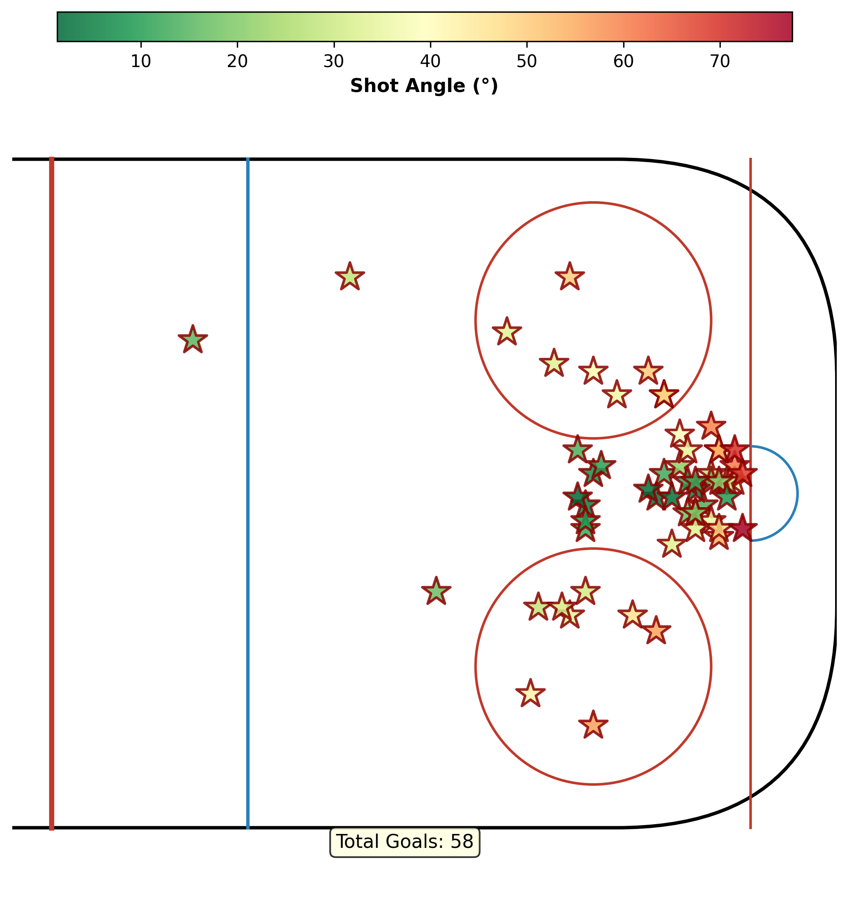{width=55% fig-align="center"}

There are 58 goals in our 10-game dataset and most of the goals are from the high-danger areas of the rink: in front of the goal and near the goal line. Low shot angles mean the shot was taken from the area in front of the goaltender, a high-danger area of the rink. High shot angles mean that the shot was taken from the area near the boards, a low-danger area of the rink. 


## Feature Engineering

We extract features from the *events and *tracking* data for the Features-Based xG Model in the thesis. Since the thesis certainly draws on different data than the 2026 Big Data Cup, we make a few assumptions along the way to match its features as closely as possible.

### Shot Location

Section 2.4.1.1 of the thesis defines three shot-location variables: the shot angle, the shot distance, and the meridian distance.

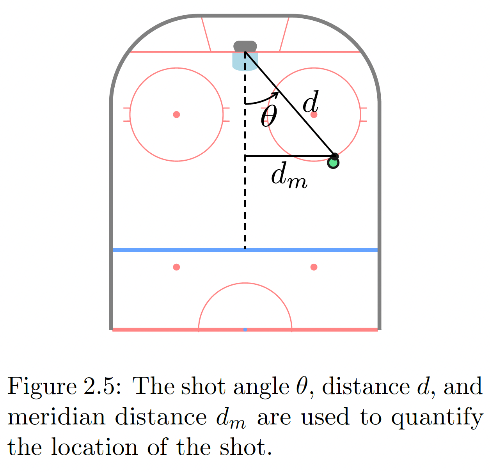{width=40% fig-align="center"}

1. The shot angle $\theta$ in degrees is defined as:

$$
\theta =\frac{180}{\pi} \left| \text{atan2}(y, x - 89) \right|.
$$

2. The meridian distance $d_m$ is the perpendicular distance from the shot location to the meridian (the "royal road" running down the center of the ice). 

3. The shot distance $d$ is the distance between the shot location and the goal.

```{python}

(
    events
    .filter(pl.col("Event").is_in(["Shot", "Goal"]))
    # Normalize to right side
    .with_columns(
        pl.when(pl.col("X_Coordinate") < 0)
        .then(-pl.col("X_Coordinate"))
        .otherwise(pl.col("X_Coordinate"))
        .alias("X_Coordinate"),

        pl.when(pl.col("X_Coordinate") < 0)
        .then(-pl.col("Y_Coordinate"))
        .otherwise(pl.col("Y_Coordinate"))
        .alias("Y_Coordinate"),
    )
    # Shot angle (degrees) and meridian distance
    .with_columns(
        (
            pl.arctan2(pl.col("Y_Coordinate"), 89 - pl.col("X_Coordinate"))
            .abs()
            * (180 / math.pi)
        ).alias("Shot_Angle"),
        pl.col("Y_Coordinate").abs().alias("d_m"),
    )
    # Distance via trigonometry: d = d_m / sin(θ), fallback to (89 - x) when Y = 0
    .with_columns(
        pl.when(pl.col("d_m") == 0)
        .then(89 - pl.col("X_Coordinate"))
        .otherwise(
            pl.col("d_m") / (pl.col("Shot_Angle") * math.pi / 180).sin()
        )
        .alias("d_trig"),
        # Euclidean distance as sanity check
        ((89 - pl.col("X_Coordinate")).pow(2) + pl.col("Y_Coordinate").pow(2))
        .sqrt()
        .alias("d_euclidean"),
    )
)
```

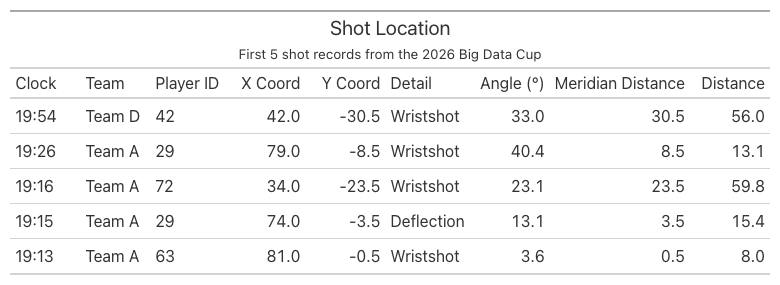


### Shooter Motion

Section 2.4.1.2 of the thesis describes two additional features: shooter's speed and direction of travel. For convenience, our model only uses shooter's speed, which is the magnitude of the shooter's velocity at the instant of their shot.

There are a few parameters we set before the feature engineering process:

1. `FPS = 30` is the tracking frame rate (frames per second). The tracking dataset contains the `Image ID` column, whose suffix is a frame counter that
ticks ~30 times per game-clock second (e.g. `_066486` -> `_066487` -> `_066488`). On average, there are 30 frames per game-clock second, and we store this information in `FPS` to convert frames to seconds using this formula:

$$
\text{time (seconds)} = \frac{\text{frame count}}{\text{FPS}}
$$

&emsp; &nbsp; Later, we use this time interval to calculate speed:

$$
\text{speed (ft/s)} = \frac{\text{distance (ft)}}{\text{time (seconds)}}
$$

2. `SMOOTH_K = 3` is the window (in frames) used to estimate speed by central difference. Rather than measuring how far a player moved between two *adjacent* frames, which is noisy, we compare the player's position `SMOOTH_K` frames ahead with their position `SMOOTH_K` frames behind, then divide by the time that elapsed between those two samples:

$$
\text{speed} \approx \frac{\sqrt{(x_{i+k} - x_{i-k})^2 + (y_{i+k} - y_{i-k})^2}}{(\text{frame}_{i+k} - \text{frame}_{i-k}) / \text{FPS}}, \quad k = \texttt{SMOOTH\_K}.
$$

&emsp; &nbsp; This method averages out per-frame jitter and gives a more stable speed estimate.

3. `FT_PER_S_TO_MPH = 0.6818` is the conversion factor from feet per second (fps) to miles per hour (mph).

4. `MAX_SPEED_MPH = 30.0` is the maximum speed (in mph) we consider valid for our model. In the 25/26 NHL season, the maximum skating speed for a player was just under 25 mph, so a speed above 30 mph is determined a tracking glitch. 

To compute player speed, we first restrict the tracking data to player rows, excluding the puck. We read the frame number from the suffix of the `Image Id` column, so that an `Image Id` of `2025-10-11 Team A @ Team D_065468` gives frame `065468`. After sorting each player's frames in chronological order, we take the change in `x` and `y` across the `SMOOTH_K`-frame central-difference window and divide the resulting Euclidean displacement by the elapsed time, converting frames to seconds with the `FPS = 30` factor introduced above. We call this new dataset "players".

```{python}
FPS = 30                  
SMOOTH_K = 3              
FT_PER_S_TO_MPH = 0.6818  
MAX_SPEED_MPH = 30.0      
MAX_SPEED_FPS = MAX_SPEED_MPH / FT_PER_S_TO_MPH

players = (
    tracking
    .filter(pl.col("Player or Puck") == "Player")
    .with_columns(
        # Numeric frame index from the Image Id suffix, and jersey as a string for matching.
        pl.col("Image Id").str.split("_").list.last().cast(pl.Int64).alias("Frame"),
        pl.col("Player Jersey Number").cast(pl.String).alias("Jersey"),
    )
    # Drop rows whose jersey couldn't be read: they'd all collapse into one bogus "null"
    # track, and differencing positions of *different* players invents huge fake speeds.
    .filter(pl.col("Jersey").is_not_null())
    # Order each player's frames in time so shift() walks consecutive samples.
    .sort(["Game", "Period", "Team", "Jersey", "Frame"])
    .with_columns(
        # Central difference over +/- SMOOTH_K frames, partitioned per player-period.
        (pl.col("Rink Location X (Feet)").shift(-SMOOTH_K) - pl.col("Rink Location X (Feet)").shift(SMOOTH_K))
            .over(["Game", "Period", "Team", "Jersey"]).alias("dx"),
        (pl.col("Rink Location Y (Feet)").shift(-SMOOTH_K) - pl.col("Rink Location Y (Feet)").shift(SMOOTH_K))
            .over(["Game", "Period", "Team", "Jersey"]).alias("dy"),
        (pl.col("Frame").shift(-SMOOTH_K) - pl.col("Frame").shift(SMOOTH_K))
            .over(["Game", "Period", "Team", "Jersey"]).alias("dframe"),
    )
    .with_columns(
        # dt = frames / fps (seconds); speed = displacement / dt, in feet per second.
        ((pl.col("dx") ** 2 + pl.col("dy") ** 2).sqrt() / (pl.col("dframe") / FPS)).alias("speed_fps")
    )
    .with_columns(
        # Null out physically impossible speeds (tracking ID-swaps / position jumps) so
        # they don't poison the per-shot pick or its fallback median.
        pl.when(pl.col("speed_fps") <= MAX_SPEED_FPS).then(pl.col("speed_fps")).otherwise(None).alias("speed_fps")
    )
    .with_columns(
        (pl.col("speed_fps") * FT_PER_S_TO_MPH).alias("speed_mph")
    )
)
```

Now that we have player speed, we filter the events data for shots and goals, calling this dataset "shots". We left join "players" onto "shots" to create shooter tracking data, then keep only the shooter's frames within one second of the shot. Among those, we pick the frame whose tracked position is closest (by Euclidean distance) to where the event records the shot — the moment the tracking best lines up with the recorded release point — and read off the shooter's speed there. The result is the shots dataset with one shooter-speed column per shot, which we label with `shot_id`.

```{python}
shots = (
    events.filter(pl.col("Event").is_in(["Shot", "Goal"]))
    .with_columns(
        pl.when(pl.col("Team") == pl.col("Home_Team")).then(pl.lit("Home"))
          .otherwise(pl.lit("Away")).alias("Track_Team")
    )
    .with_row_index("shot_id")
)

# Candidate shooter frames: same player, within the event second (+/-1s).
cand = (
    shots.join(
        players.select([
            "Game", "Period", "Team", "Jersey", "Game_Clock_Seconds", "Frame",
            "Rink Location X (Feet)", "Rink Location Y (Feet)", "speed_fps",
        ]),
        left_on=["Game", "Period", "Track_Team", "Player_Id"],
        right_on=["Game", "Period", "Team", "Jersey"], how="left",
    )
    .filter((pl.col("Game_Clock_Seconds") - pl.col("Clock_Seconds")).abs() <= 1)
    .filter(pl.col("Rink Location X (Feet)").is_not_null()
            & pl.col("Rink Location Y (Feet)").is_not_null())
    .with_columns(
        ((pl.col("Rink Location X (Feet)") - pl.col("X_Coordinate")) ** 2
         + (pl.col("Rink Location Y (Feet)") - pl.col("Y_Coordinate")) ** 2).sqrt().alias("d_direct"),
        ((pl.col("Rink Location X (Feet)") + pl.col("X_Coordinate")) ** 2
         + (pl.col("Rink Location Y (Feet)") + pl.col("Y_Coordinate")) ** 2).sqrt().alias("d_flip"),
    )
    .with_columns(
        pl.min_horizontal("d_direct", "d_flip").alias("match_dist"),
        (pl.col("d_flip") < pl.col("d_direct")).alias("used_flip"),
    )
)

# Release frame = the candidate closest to the release point (nulls_last so a real
# match is never beaten by a missing distance).
release = (
    cand.sort("match_dist", nulls_last=True)
    .group_by("shot_id", maintain_order=True)
    .first()
    .select(["shot_id", "Frame", "match_dist", "used_flip", "speed_fps"])
)

# Fallback: representative speed over the whole event-second window.
window_med = cand.group_by("shot_id").agg(
    pl.col("speed_fps").median().alias("speed_fps_window_median"),
    pl.len().alias("n_candidates"),
)

# A match is trusted when the closest frame is within ~10 ft and has a defined speed;
# otherwise fall back to the window median (flagged), or mark no tracking at all.
MAX_MATCH_DIST = 10.0
shot_speeds = (
    shots.join(release, on="shot_id", how="left")
    .join(window_med, on="shot_id", how="left")
    .with_columns(
        pl.when((pl.col("match_dist") <= MAX_MATCH_DIST) & pl.col("speed_fps").is_not_null())
          .then(pl.col("speed_fps"))
          .otherwise(pl.col("speed_fps_window_median"))
          .alias("shooter_speed_fps"),
        pl.when((pl.col("match_dist") <= MAX_MATCH_DIST) & pl.col("speed_fps").is_not_null())
          .then(pl.lit("matched"))
          .when(pl.col("speed_fps_window_median").is_not_null())
          .then(pl.lit("fallback_window_median"))
          .otherwise(pl.lit("no_tracking"))
          .alias("match_quality"),
    )
    .with_columns((pl.col("shooter_speed_fps") * 0.6818).alias("shooter_speed_mph"))
    .sort(["Game", "Period", "Clock_Seconds"], descending=[False, True])
)
```


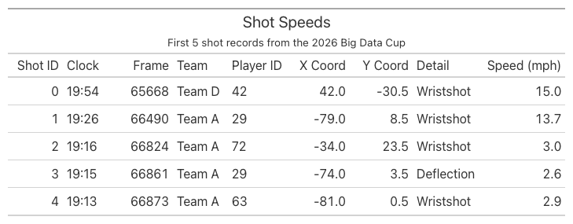{fig-align="center"}


### Pressure

In Section 2.4.1.3 of the thesis, pressure is defined as the distance from the shot location to the closest and second-closest defending skater. A continuous distance is more descriptive than counting defenders within 6 ft, and adding the second-closest defender captures pressure from multiple defenders.

To compute pressure, we remove goaltenders from the players dataset and left join the remaining defenders onto the shots dataset, computing the distance from each defender to the shot. For each shot, we then keep the two smallest distances, giving the distance from the shot location to the closest and second-closest defenders.

```{python}
# Defending skaters only: opposite tracking team, real jersey numbers, no goalies.
defenders = (
    players
    .filter(pl.col("Jersey") != "Go")
    .select([
        "Game", "Period", "Team", "Frame",
        "Rink Location X (Feet)", "Rink Location Y (Feet)",
    ])
)

# Per shot: the defending team, the release frame, and the shot location in tracking
# coordinates (negated when the release match used the flip).
shot_frames = (
    shots
    .join(release.select(["shot_id", "Frame", "used_flip"]), on="shot_id", how="left")
    .with_columns(
        pl.when(pl.col("Track_Team") == "Home").then(pl.lit("Away"))
          .otherwise(pl.lit("Home")).alias("Def_Team"),
        pl.when(pl.col("used_flip")).then(-pl.col("X_Coordinate"))
          .otherwise(pl.col("X_Coordinate")).alias("Shot_X"),
        pl.when(pl.col("used_flip")).then(-pl.col("Y_Coordinate"))
          .otherwise(pl.col("Y_Coordinate")).alias("Shot_Y"),
    )
    .select(["shot_id", "Game", "Period", "Def_Team", "Frame", "Shot_X", "Shot_Y"])
)

# Join each shot to every defending skater in its release frame; measure distance.
pressure = (
    shot_frames
    .join(
        defenders,
        left_on=["Game", "Period", "Def_Team", "Frame"],
        right_on=["Game", "Period", "Team", "Frame"],
        how="left",
    )
    .with_columns(
        ((pl.col("Rink Location X (Feet)") - pl.col("Shot_X")) ** 2
         + (pl.col("Rink Location Y (Feet)") - pl.col("Shot_Y")) ** 2)
        .sqrt().alias("def_dist")
    )
    .group_by("shot_id", maintain_order=True)
    .agg(
        pl.col("def_dist").sort(nulls_last=True).alias("def_dists"),
        pl.col("def_dist").is_not_null().sum().alias("n_defenders"),
    )
    .with_columns(
        pl.col("def_dists").list.get(0, null_on_oob=True).alias("closest_def_dist"),
        pl.col("def_dists").list.get(1, null_on_oob=True).alias("second_closest_def_dist"),
    )
    .drop("def_dists")
)

# Attach to the shots table for use as expected-goals model features.
shot_pressure = shots.join(pressure, on="shot_id", how="left").select(
    "Period", "Clock", "Team", "Player_Id", "Event", "Detail_1",
    "n_defenders", "closest_def_dist", "second_closest_def_dist",
)
```


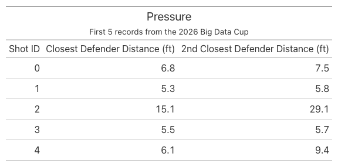{fig-align="center"}


### Pre-Shot Movement

Section 2.4.1.4 of the thesis discusses pre-shot movement: how the puck moved in the seconds leading up to the shot. It is a key predictor because lateral puck movement forces the goaltender to move side to side, which can leave them out of position when the shot is released.

This section focuses on the meridian line, which is visualized below:

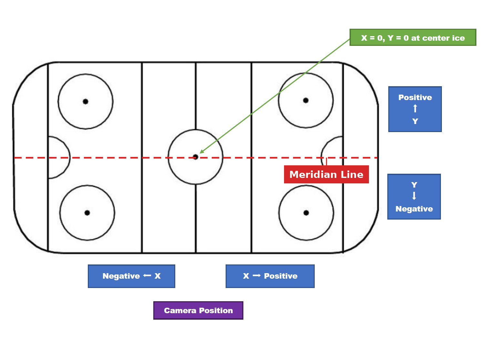{width=85% fig-align="center"}


Pre-shot movement features are focused on lateral puck movement (east-west):

1. Time since the puck last crossed the meridian: Seconds since the puck last crossed the meridian.
2. Location where the puck crossed the meridian: Measured as the distance to the goal line
3. Average puck speed: Average puck speed in the 1-second before the shot.

Features 1 and 2 are only defined when the crossing happened within 5-seconds before the shot.

To compute the pre-shot movement features, we first filter for the puck in the tracking dataset. Then, we take the change in `x` and `y` across the `SMOOTH_K`-frame central-difference window and divide the resulting Euclidean displacement by the elapsed time, converting frames to seconds with the `FPS = 30` factor introduced above. We call this new dataset "puck".

Then, we left-join this puck dataset onto the shots dataset and keep only the puck frames within 5 seconds (150 frames) before each shot. The resulting dataset is called the "window" dataset. In the window dataset, a meridian crossing shows up as a sign change in the puck's y-position between consecutive frames (the puck passed through the y=0 line), so we keep those rows to locate the most recent crossing before the shot. With the resulting rows, we get the first two features: time since meridian crossing and the location where the puck crossed the meridian.

To compute the average puck speed, we filter for rows in the window dataset where there is a 1-second (30 frames) difference in the frame when the shot was taken and the puck tracking frame. Then, we get the average of all the puck speeds recorded for a single shot id to find the average puck speed 1-second before the shot. The resulting average puck speed captures how fast the puck was moving into the shot.

```{python}
# The puck moves far faster than skaters, so the 30 mph skater cap doesn't apply; we
# only drop physically impossible jumps (tracking glitches) above ~110 mph.
MAX_PUCK_SPEED_MPH = 110.0
MAX_PUCK_SPEED_FPS = MAX_PUCK_SPEED_MPH / FT_PER_S_TO_MPH

puck = (
    tracking
    .filter(pl.col("Player or Puck") == "Puck")
    .filter(pl.col("Rink Location X (Feet)").is_not_null())
    .with_columns(
        pl.col("Image Id").str.split("_").list.last().cast(pl.Int64).alias("Frame")
    )
    .sort(["Game", "Period", "Frame"])
    .with_columns(
        (pl.col("Rink Location X (Feet)").shift(-SMOOTH_K) - pl.col("Rink Location X (Feet)").shift(SMOOTH_K)).over(["Game", "Period"]).alias("dx"),
        (pl.col("Rink Location Y (Feet)").shift(-SMOOTH_K) - pl.col("Rink Location Y (Feet)").shift(SMOOTH_K)).over(["Game", "Period"]).alias("dy"),
        (pl.col("Frame").shift(-SMOOTH_K) - pl.col("Frame").shift(SMOOTH_K)).over(["Game", "Period"]).alias("dframe"),
    )
    .with_columns(
        ((pl.col("dx") ** 2 + pl.col("dy") ** 2).sqrt() / (pl.col("dframe") / FPS)).alias("puck_speed_fps")
    )
    .with_columns(
        pl.when(pl.col("puck_speed_fps") <= MAX_PUCK_SPEED_FPS).then(pl.col("puck_speed_fps")).otherwise(None).alias("puck_speed_fps")
    )
    .select(["Game", "Period", "Frame", "Rink Location X (Feet)", "Rink Location Y (Feet)", "puck_speed_fps"])
    .rename({"Rink Location X (Feet)": "puck_x", "Rink Location Y (Feet)": "puck_y"})
)

# Per-shot orientation: the shot location in tracking coords (negated when the release
# match used the flip) tells us which goal line the team attacks (+89 if X > 0).
shot_orient = (
    shots.join(release.select(["shot_id", "Frame", "used_flip"]), on="shot_id", how="left")
    .with_columns(
        pl.when(pl.col("used_flip")).then(-pl.col("X_Coordinate")).otherwise(pl.col("X_Coordinate")).alias("Shot_X_track")
    )
    .with_columns((pl.col("Shot_X_track") > 0).alias("attack_right"))
    .select(["shot_id", "Game", "Period", "Frame", "attack_right"])
    .rename({"Frame": "shot_frame"})
)

# Puck samples in the same period within 5 s (150 frames) before each shot, with
# coordinates normalized to attack-right. (The meridian sign-change is invariant to the
# flip; normalizing X only matters for the goal-line distance.)
window = (
    shot_orient.join(puck, on=["Game", "Period"], how="left")
    .filter((pl.col("shot_frame") - pl.col("Frame")).is_between(0, 5 * FPS))
    .with_columns(
        pl.when(pl.col("attack_right")).then(pl.col("puck_x")).otherwise(-pl.col("puck_x")).alias("px"),
        pl.when(pl.col("attack_right")).then(pl.col("puck_y")).otherwise(-pl.col("puck_y")).alias("py"),
    )
    .sort(["shot_id", "Frame"])
)

# Feature 3: average puck speed over the 1 s (30 frames) before the shot.
avg_speed = (
    window.filter((pl.col("shot_frame") - pl.col("Frame")).is_between(0, 1 * FPS))
    .group_by("shot_id")
    .agg(pl.col("puck_speed_fps").mean().alias("avg_puck_speed_fps"))
    .with_columns((pl.col("avg_puck_speed_fps") * FT_PER_S_TO_MPH).alias("avg_puck_speed_mph"))
)

# Features 1 & 2: the most recent meridian crossing within the 5 s window. A crossing is
# a sign change in py between consecutive frames; we linearly interpolate the X where
# py = 0, then keep the latest crossing (largest Frame) before the shot.
crossings = (
    window.with_columns(
        pl.col("px").shift(1).over("shot_id").alias("px_prev"),
        pl.col("py").shift(1).over("shot_id").alias("py_prev"),
    )
    .filter(pl.col("py_prev").is_not_null() & (pl.col("py_prev") * pl.col("py") < 0))
    .with_columns(
        (pl.col("px_prev") + (pl.col("px") - pl.col("px_prev")) * (0 - pl.col("py_prev")) / (pl.col("py") - pl.col("py_prev"))).alias("x_cross")
    )
    .sort(["shot_id", "Frame"])
    .group_by("shot_id", maintain_order=True)
    .last()
    .with_columns(
        ((pl.col("shot_frame") - pl.col("Frame")) / FPS).alias("time_since_meridian"),
        (89 - pl.col("x_cross")).alias("meridian_cross_dist"),  # negative if crossed behind the net
    )
    .select(["shot_id", "time_since_meridian", "meridian_cross_dist"])
)

# Attach to the shots table; nulls mark shots with no meridian crossing in the prior 5 s.
pre_shot_movement = (
    shots.join(crossings, on="shot_id", how="left")
    .join(avg_speed, on="shot_id", how="left")
    .sort(["Period", "Clock_Seconds"], descending=[False, True])
    .select(
        "Period", "Clock", "Team", "Player_Id", "Event", "Detail_1",
        "time_since_meridian", "meridian_cross_dist", "avg_puck_speed_fps", "avg_puck_speed_mph",
    )
)
```

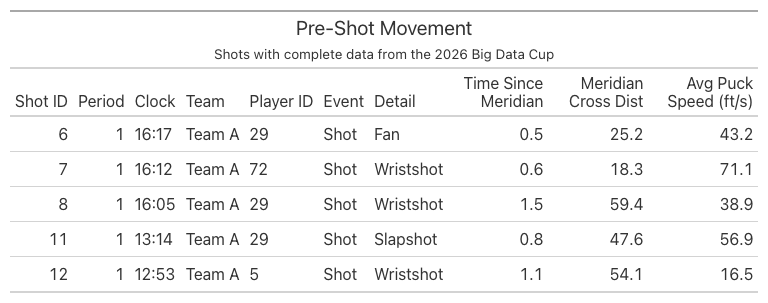


### Traffic

Section 2.4.1.5 of the thesis models traffic with goal-face occlusion. For each skater on the ice, draw a straight line from the shooter through that skater and extend it to the goal line. Where that line crosses the goal line is, in effect, the "shadow" that skater casts onto the net from the shooter's viewpoint. Center a Gaussian (normal distribution) at that shadow point, with a standard deviation of 1.5 ft (a tunable parameter). Then integrate that Gaussian over the interval from −3 ft to +3 ft, which is the 6-ft-wide opening of the goal. The end result is goal-face occlusion.

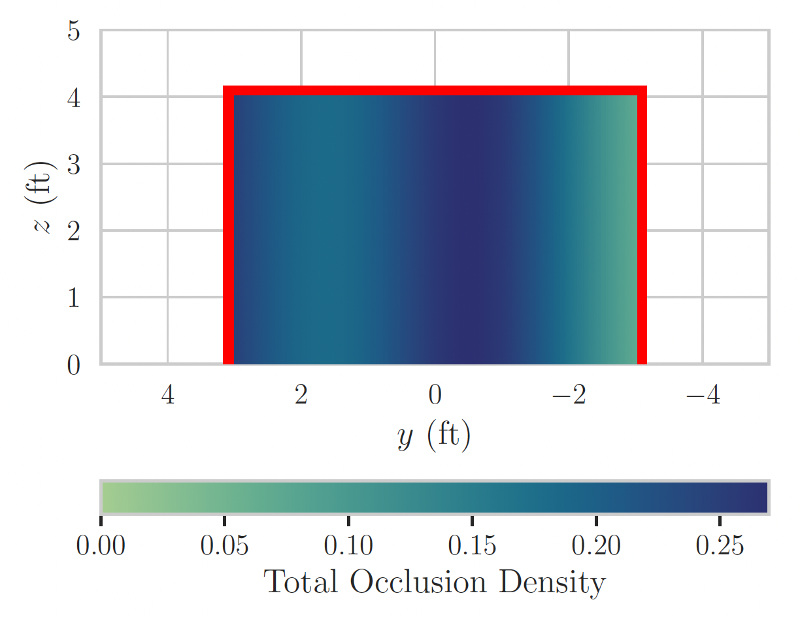{width=55% fig-align="center"}

To calculate occlusion, we take the player tracking data with goaltenders removed and left-join it onto the shots dataset, pairing each shot with every skater on the ice at its release frame, then drop the shooter row. For each remaining skater, we use the linear interpolation equation below to find where the line from the shooter through that skater crosses the goal line, i.e. its y-intercept on the goal line.

$$
y_{\text{goal line}}= \text{ShotY} + (\text{SkaterY} - \text{ShotY}) \cdot \frac{\text{GoalX} - \text{ShotX}}{\text{SkaterX} - \text{ShotX}}
$$

Then, we find the total occlusion density between the two goal posts using the formula below to compute the probability mass of a normal bell curve:

$$
\text{Occlusion Density} = \Phi\left(\frac{\text{GOALPOST} - y_{\text{goal}}}{\sigma}\right) - \Phi\left(\frac{-\text{GOALPOST} - y_{\text{goal}}}{\sigma}\right)
$$


```{python}
import numpy as np

SIGMA = 1.5  # Gaussian standard deviation (feet)
GOAL_HALF = 3.0  # half-width of goal face (feet)


def _normal_cdf_batched(x: np.ndarray) -> np.ndarray:
    """Vectorised normal CDF using math.erf identity: Φ(z) = 0.5*(1+erf(z/√2))."""
    return 0.5 * (1.0 + np.vectorize(math.erf)(x / math.sqrt(2)))


# --- Per-shot info in tracking coordinates (reuses release match) ---
shot_info = (
    shots.join(release.select(["shot_id", "Frame", "used_flip"]), on="shot_id", how="left")
    .with_columns(
        # Shot location in tracking coords
        pl.when(pl.col("used_flip")).then(-pl.col("X_Coordinate")).otherwise(pl.col("X_Coordinate")).alias("Shot_X"),
        pl.when(pl.col("used_flip")).then(-pl.col("Y_Coordinate")).otherwise(pl.col("Y_Coordinate")).alias("Shot_Y"),
    )
    .with_columns(
        # Goal line: +89 if attacking right, −89 if attacking left
        pl.when(pl.col("Shot_X") > 0).then(pl.lit(89.0)).otherwise(pl.lit(-89.0)).alias("goal_x"),
    )
    .select(["shot_id", "Game", "Period", "Frame", "Track_Team", "Player_Id", "Shot_X", "Shot_Y", "goal_x"])
)

# --- All non-goalie skaters at each shot's release frame ---
skaters_at_frame = (
    players
    .filter(pl.col("Jersey") != "Go")
    .select(["Game", "Period", "Team", "Jersey", "Frame",
             "Rink Location X (Feet)", "Rink Location Y (Feet)"])
    .rename({"Rink Location X (Feet)": "sk_x", "Rink Location Y (Feet)": "sk_y"})
)

# Join each shot with every skater present at the release frame, then drop the shooter.
occlusion_pairs = (
    shot_info.join(
        skaters_at_frame,
        left_on=["Game", "Period", "Frame"],
        right_on=["Game", "Period", "Frame"],
        how="left",
    )
    # Exclude the shooter (same team in tracking namespace + same jersey)
    .filter(
        ~((pl.col("Track_Team") == pl.col("Team")) & (pl.col("Player_Id") == pl.col("Jersey")))
    )
    .filter(pl.col("sk_x").is_not_null() & pl.col("sk_y").is_not_null())
    # Compute y-intercept on the goal line
    .with_columns(
        (pl.col("Shot_Y")
         + (pl.col("sk_y") - pl.col("Shot_Y"))
           * (pl.col("goal_x") - pl.col("Shot_X"))
           / (pl.col("sk_x") - pl.col("Shot_X"))
        ).alias("y_goal")
    )
    # Drop degenerate cases: skater at same x as shooter, or intercept is undefined
    .filter(pl.col("y_goal").is_not_null() & pl.col("y_goal").is_finite())
)

# Compute Gaussian contribution per skater via map_batches
occlusion_pairs = occlusion_pairs.with_columns(
    pl.struct(["y_goal"]).map_batches(
        lambda s: pl.Series(
            _normal_cdf_batched((GOAL_HALF - s.struct.field("y_goal").to_numpy()) / SIGMA)
            - _normal_cdf_batched((-GOAL_HALF - s.struct.field("y_goal").to_numpy()) / SIGMA)
        ),
        return_dtype=pl.Float64,
    ).alias("occlusion_contribution")
)

# Sum per shot
total_occlusion = (
    occlusion_pairs
    .group_by("shot_id", maintain_order=True)
    .agg(
        (1.0 - (1.0 - pl.col("occlusion_contribution")).product())
        .alias("total_occlusion")
    )
)

shot_occlusion = (
    shots.join(total_occlusion, on="shot_id", how="left")
    .select(
        "Period", "Clock", "Team", "Player_Id", "Event", "Detail_1",
        "X_Coordinate", "Y_Coordinate", "total_occlusion",
    )
)
```

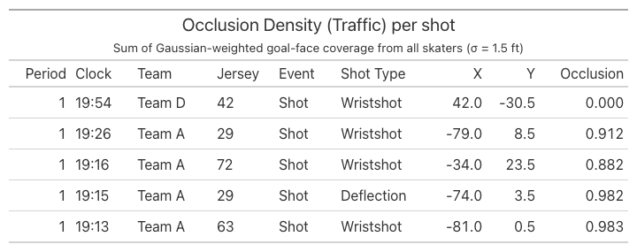{fig-align="center"}

### Goaltender Positioning

Section 2.4.1.6 of the thesis deals with features related to goaltender positioning, goaltender angle and depth relative to the goal center. Figure 2.9 illustrates goaltender angle $\zeta$ and depth $d_g$:

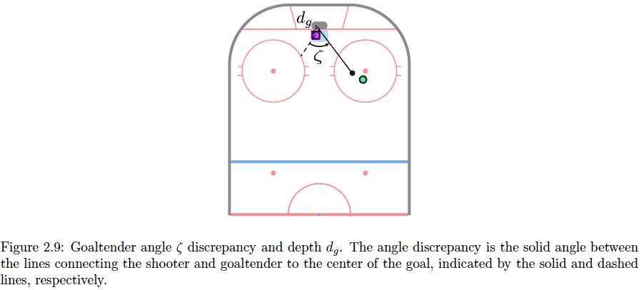

The figure shows that an angle near 0° means the goalie is squared up to the shooter, while a larger angle means they are off-angle, leaving more of the net exposed. The depth, meanwhile, captures how far the goalie has ventured out of the crease.

To compute these two features, we filter the player tracking data for goaltenders and left-join it onto the shots dataset. For each shot, we form two vectors from the goal center — (89, 0) or (−89, 0) — one pointing to the shooter and the other to the goaltender. The angle between these vectors gives the goaltender angle, and the length of the goaltender vector gives the goaltender depth.


```{python}
# Per shot: defending team, release frame, shot location in tracking coords, goal center.
shot_goalie_ctx = (
    shots.join(release.select(["shot_id", "Frame", "used_flip"]), on="shot_id", how="left")
    .with_columns(
        pl.when(pl.col("Track_Team") == "Home").then(pl.lit("Away"))
          .otherwise(pl.lit("Home")).alias("Def_Team"),
        pl.when(pl.col("used_flip")).then(-pl.col("X_Coordinate"))
          .otherwise(pl.col("X_Coordinate")).alias("Shot_X"),
        pl.when(pl.col("used_flip")).then(-pl.col("Y_Coordinate"))
          .otherwise(pl.col("Y_Coordinate")).alias("Shot_Y"),
    )
    .with_columns(
        # Goal line: +89 if attacking right, −89 if attacking left.
        pl.when(pl.col("Shot_X") > 0).then(pl.lit(89.0)).otherwise(pl.lit(-89.0)).alias("goal_x"),
    )
    .select(["shot_id", "Game", "Period", "Def_Team", "Frame", "Shot_X", "Shot_Y", "goal_x"])
)

# Defending goaltender's tracked position at each shot's release frame.
goalies = (
    players
    .filter(pl.col("Jersey") == "Go")
    .select(["Game", "Period", "Team", "Frame",
             "Rink Location X (Feet)", "Rink Location Y (Feet)"])
    .rename({"Rink Location X (Feet)": "goalie_x", "Rink Location Y (Feet)": "goalie_y"})
)

goaltender_positioning = (
    shot_goalie_ctx
    .join(
        goalies,
        left_on=["Game", "Period", "Def_Team", "Frame"],
        right_on=["Game", "Period", "Team", "Frame"],
        how="left",
    )
    # One goalie per team-frame is expected; guard against duplicate tracks.
    .group_by("shot_id", maintain_order=True)
    .first()
    .with_columns(
        # Vectors from the goal center to the shooter and to the goalie.
        (pl.col("Shot_X") - pl.col("goal_x")).alias("s_x"),
        pl.col("Shot_Y").alias("s_y"),
        (pl.col("goalie_x") - pl.col("goal_x")).alias("g_x"),
        pl.col("goalie_y").alias("g_y"),
    )
    .with_columns(
        (pl.col("s_x") ** 2 + pl.col("s_y") ** 2).sqrt().alias("s_mag"),
        (pl.col("g_x") ** 2 + pl.col("g_y") ** 2).sqrt().alias("g_mag"),
        (pl.col("s_x") * pl.col("g_x") + pl.col("s_y") * pl.col("g_y")).alias("dot"),
    )
    .with_columns(
        # d_g: distance from the goaltender to the goal center.
        pl.col("g_mag").alias("goaltender_depth"),
        # ζ (degrees): undefined when shooter or goalie sits exactly at the goal center.
        pl.when((pl.col("s_mag") > 0) & (pl.col("g_mag") > 0))
          .then(
              (pl.col("dot") / (pl.col("s_mag") * pl.col("g_mag")))
              .clip(-1.0, 1.0).arccos() * (180 / math.pi)
          )
          .otherwise(None)
          .alias("angle_discrepancy"),
    )
    .select(["shot_id", "angle_discrepancy", "goaltender_depth"])
)

# Attach to the shots table for use as expected-goals model features.
shot_goaltender = (
    shots.join(goaltender_positioning, on="shot_id", how="left")
    .sort(["Period", "Clock_Seconds"], descending=[False, True])
    .select(
        "Period", "Clock", "Team", "Player_Id", "Event", "Detail_1",
        "angle_discrepancy", "goaltender_depth",
    )
)
```

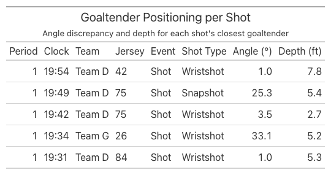{fig-align="center"}


## Feature-Based Expected Goals (xG) Model

With feature engineering complete, we join all of the features above on `shot_id` to assemble a single modeling dataset. The result spans 10 games and holds 1,190 shots across 21 columns, 58 of which are goals.

```{python}
# Shot Location was computed display-only above, so its features are recomputed here
# keyed by shot_id (same logic: normalize to the right side, then angle/distances).
shot_location = (
    shots
    # Normalize to right side
    .with_columns(
        pl.when(pl.col("X_Coordinate") < 0)
        .then(-pl.col("X_Coordinate"))
        .otherwise(pl.col("X_Coordinate"))
        .alias("X_Coordinate"),

        pl.when(pl.col("X_Coordinate") < 0)
        .then(-pl.col("Y_Coordinate"))
        .otherwise(pl.col("Y_Coordinate"))
        .alias("Y_Coordinate"),
    )
    # Shot angle (degrees), meridian distance, and distance to goal
    .with_columns(
        (
            pl.arctan2(pl.col("Y_Coordinate"), 89 - pl.col("X_Coordinate"))
            .abs()
            * (180 / math.pi)
        ).alias("Shot_Angle"),
        pl.col("Y_Coordinate").abs().alias("d_m"),
    )
    .with_columns(
        ((89 - pl.col("X_Coordinate")).pow(2) + pl.col("Y_Coordinate").pow(2))
        .sqrt()
        .alias("shot_distance"),
    )
    .select("shot_id", "Shot_Angle", "d_m", "shot_distance")
)

# Unify all expected-goals features into one per-shot dataset by joining on shot_id.
shot_features = (
    shots.select("shot_id", "Period", "Clock", "Clock_Seconds", "Team", "Player_Id", "Event", "Detail_1")
    .with_columns((pl.col("Event") == "Goal").cast(pl.Int8).alias("is_goal"))
    # Shot Location
    .join(shot_location, on="shot_id", how="left")
    # Shooter Motion
    .join(
        shot_speeds.select("shot_id", "shooter_speed_fps", "shooter_speed_mph", "match_quality"),
        on="shot_id", how="left",
    )
    # Pressure
    .join(pressure, on="shot_id", how="left")
    # Pre-Shot Movement
    .join(crossings, on="shot_id", how="left")
    .join(avg_speed, on="shot_id", how="left")
    # Traffic
    .join(total_occlusion, on="shot_id", how="left")
    # Goaltender Positioning
    .join(goaltender_positioning, on="shot_id", how="left")
    .sort(["Period", "Clock_Seconds"], descending=[False, True])
    .drop("Clock_Seconds")
    .drop("avg_puck_speed_mph")
)

# Final output:
#  A single table with one row per shot and all expected-goals features ready for modeling.
shot_features

```

The resulting dataset, with one row per shot and every feature attached, looks like this:

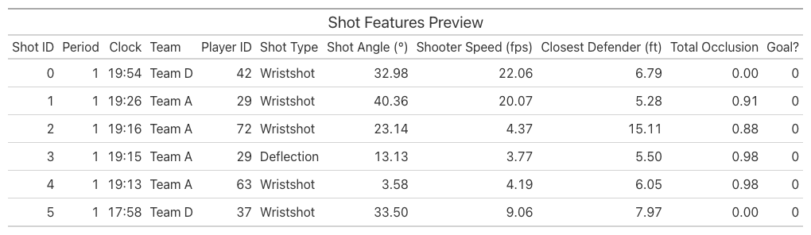

### XGBoost

Section 2.4.2 of the thesis lays out how to train an XGBoost model on the dataset. As the thesis emphasizes, the goal is not to classify each shot as a goal or non-goal, but to estimate its probability of becoming a goal. Since the output is a probability, the model is evaluated with three metrics: binary cross-entropy loss and the Brier score, which directly score probabilistic predictions, along with the area under the receiver operating characteristic curve (AUC).

We adopt the hyperparameters from the thesis: a maximum tree depth of 4, 125 trees, and a learning rate of 0.075. Because goals are rare, the target variable is heavily imbalanced, with only 4.9% of shots labeled as a goal, so we evaluate the model with stratified 5-fold group cross-validation, which preserves that goal rate within each fold. With 10 games in the dataset, each fold trains on the equivalent of 8 games and tests on the remaining 2 games. 

```{python}
import xgboost as xgb
from sklearn.model_selection import StratifiedGroupKFold
from sklearn.metrics import log_loss, brier_score_loss, roc_auc_score

FEATURES = [
    # Shot Location
    "Shot_Angle", "d_m", "shot_distance",
    # Shooter Motion
    "shooter_speed_fps",
    # Pressure
    "closest_def_dist", "second_closest_def_dist",
    # Pre-Shot Movement
    "time_since_meridian", "meridian_cross_dist", "avg_puck_speed_fps",
    # Traffic
    "total_occlusion",
    # Goaltender Positioning
    "angle_discrepancy", "goaltender_depth",
    # Shot type
    "Detail_1",
]
# Excluded: identifiers (shot_id/Period/Clock/Team/Player_Id), Event (it *is* the
# target), match_quality (data-quality flag), and the *_mph speed duplicates.

model_df = shot_features.to_pandas()
X = model_df[FEATURES].copy()
X["Detail_1"] = X["Detail_1"].astype("category")
y = model_df["is_goal"].to_numpy()
groups = model_df["Game"].to_numpy()  # split by game so no game leaks across folds

# Hyperparameters from the cited paper (selected there via cross-validation):
# tree depth 4, 125 trees, learning rate 0.075.
xgb_params = dict(
    max_depth=4,
    n_estimators=125,
    learning_rate=0.075,
    objective="binary:logistic",
    eval_metric="logloss",
    tree_method="hist",
    enable_categorical=True,  # native handling of the shot-type categorical
    random_state=42,
)

# Pooled out-of-fold predictions: each fold's model predicts the shots it never saw.
# Grouped by game so every test fold is made of whole games the model never trained on
# (avoids leaking game-specific signal across folds); stratified to keep each fold near
# the overall goal rate.
cv = StratifiedGroupKFold(n_splits=5, shuffle=True, random_state=42)
oof_prob = np.full(len(y), np.nan)
for train_idx, test_idx in cv.split(X, y, groups):
    model = xgb.XGBClassifier(**xgb_params)
    model.fit(X.iloc[train_idx], y[train_idx])
    oof_prob[test_idx] = model.predict_proba(X.iloc[test_idx])[:, 1]
assert not np.isnan(oof_prob).any()

# No-skill baseline: predict the base rate for every shot.
base_rate = y.mean()
baseline_prob = np.full(len(y), base_rate)

metrics = pl.DataFrame({
    "Metric": [
        "Binary cross-entropy",
        "Brier score",
        "ROC AUC",
    ],
    "Model": [
        log_loss(y, oof_prob),
        brier_score_loss(y, oof_prob),
        roc_auc_score(y, oof_prob),
    ],
    "Baseline": [
        log_loss(y, baseline_prob),
        brier_score_loss(y, baseline_prob),
        0.5,
    ],
})
```


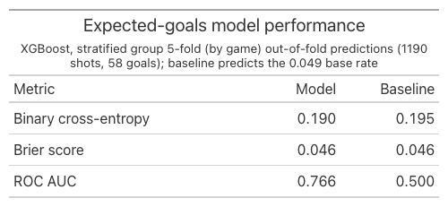{fig-align="center"}

Our metrics are not as impressive as those in the thesis's Table 2.4, largely because of the gap in sample size. The thesis works with 79,624 shots, of which 4.08% are goals, while our dataset has just 1,190 shots — roughly 67 times fewer. The difference in goals is just as stark: the thesis trains and evaluates on 3,248 goals, compared to our 58 goals.

We calculate absolute SHAP values, which quantify the impact of each feature on the model's predictions.

```{python}
import matplotlib.pyplot as plt

FEATURE_LABELS = {
    "Shot_Angle": "Shot Angle",
    "d_m": "Meridian Distance",
    "shot_distance": "Shot Distance",
    "shooter_speed_fps": "Shooter Speed",
    "closest_def_dist": "Closest Defender Dist.",
    "second_closest_def_dist": "2nd Closest Defender Dist.",
    "time_since_meridian": "Time Since Meridian",
    "meridian_cross_dist": "Meridian Crossing Dist.",
    "avg_puck_speed_fps": "Avg. Puck Speed (Feet/Second)",
    "total_occlusion": "Total Occlusion",
    "angle_discrepancy": "Angle Discrepancy",
    "goaltender_depth": "Goaltender Depth",
    "Detail_1": "Shot Type",
}

shap_pd = shap_importance.to_pandas()
shap_pd["Label"] = shap_pd["Feature"].map(FEATURE_LABELS)

fig, ax = plt.subplots(figsize=(8, 5))
ax.barh(shap_pd["Label"], shap_pd["Mean_Abs_SHAP"])
ax.invert_yaxis()
ax.set_xlabel("Mean |SHAP value|")
ax.set_title("Feature importance (mean absolute SHAP value)")
plt.tight_layout()
fig.savefig("shap_feature_importance.png", dpi=300)
plt.show()
```

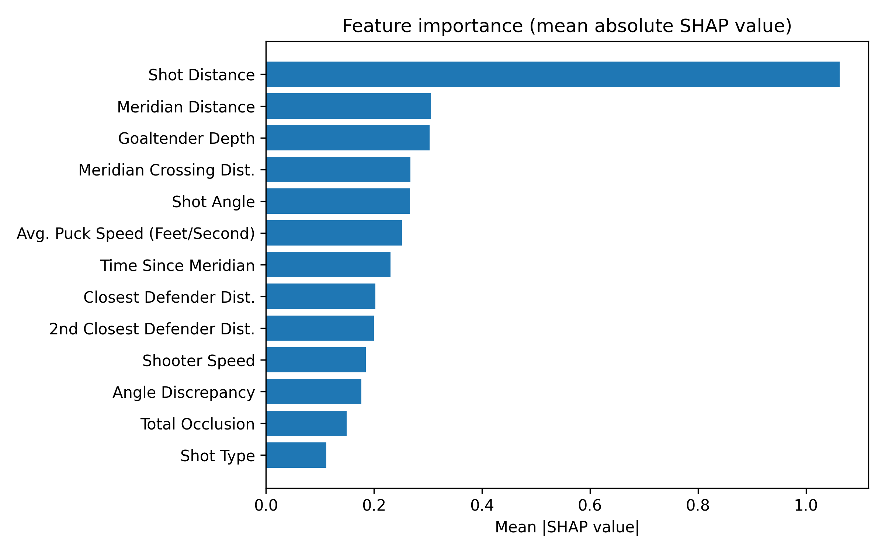{width=80% fig-align="left"}

This plot closely resembles Figure 2.11 from the thesis, which shows that Shot Distance and Meridian Distance are the two most important features to the xG model. Interestingly, our plot illustrates that shot type and total occlusion are the two least important features.

Finally, following Figure 2.13 of the thesis, we create SHAP dependence plots, which chart each shot's SHAP value against its underlying feature value, one panel per feature.

```{python}
import matplotlib.pyplot as plt
import numpy as np

# Features to plot (excluding categorical Shot Type) sorted by importance
plot_features = [f for f in shap_importance["Feature"].to_list() if f != "Detail_1"]

FEATURE_LABELS_UNITS = {
    "shot_distance": "Shot Distance (ft)",
    "d_m": "Meridian Distance (ft)",
    "goaltender_depth": "Goaltender Depth (ft)",
    "meridian_cross_dist": "Meridian Crossing Dist. (ft)",
    "Shot_Angle": "Shot Angle (deg.)",
    "avg_puck_speed_fps": "Avg. Puck Speed (ft/s)",
    "time_since_meridian": "Time Since Meridian (s)",
    "closest_def_dist": "Closest Defender Dist. (ft)",
    "second_closest_def_dist": "2nd Closest Defender Dist. (ft)",
    "shooter_speed_fps": "Shooter Speed (ft/s)",
    "angle_discrepancy": "Angle Discrepancy (deg.)",
    "total_occlusion": "Total Occlusion",
}

# Map feature names to their column index in X / shap_values
feat_idx = {f: i for i, f in enumerate(FEATURES)}

ncols = 3
nrows = 4
fig, axes = plt.subplots(nrows, ncols, figsize=(14, 14))
axes_flat = axes.flatten()

for i, feat in enumerate(plot_features):
    ax = axes_flat[i]
    col_idx = feat_idx[feat]
    x_vals = X.iloc[:, col_idx].values.astype(float)
    y_vals = shap_values[:, col_idx]

    # Background histogram
    ax2 = ax.twinx()
    ax2.hist(x_vals, bins=30, color="lightgray", edgecolor="none", alpha=0.6)
    ax2.set_yticks([])
    ax2.set_ylabel("")

    # SHAP scatter (on top)
    ax.scatter(x_vals, y_vals, s=2, alpha=0.5, color="#1f77b4", zorder=3)
    ax.set_xlabel(FEATURE_LABELS_UNITS.get(feat, feat))
    ax.set_ylabel("SHAP Value")
    ax.set_axisbelow(True)
    ax.grid(True, alpha=0.3)

# Hide any unused subplots
for j in range(len(plot_features), len(axes_flat)):
    axes_flat[j].set_visible(False)

plt.tight_layout()
fig.savefig("shap_dependence_grid.png", dpi=300)
plt.show()
```

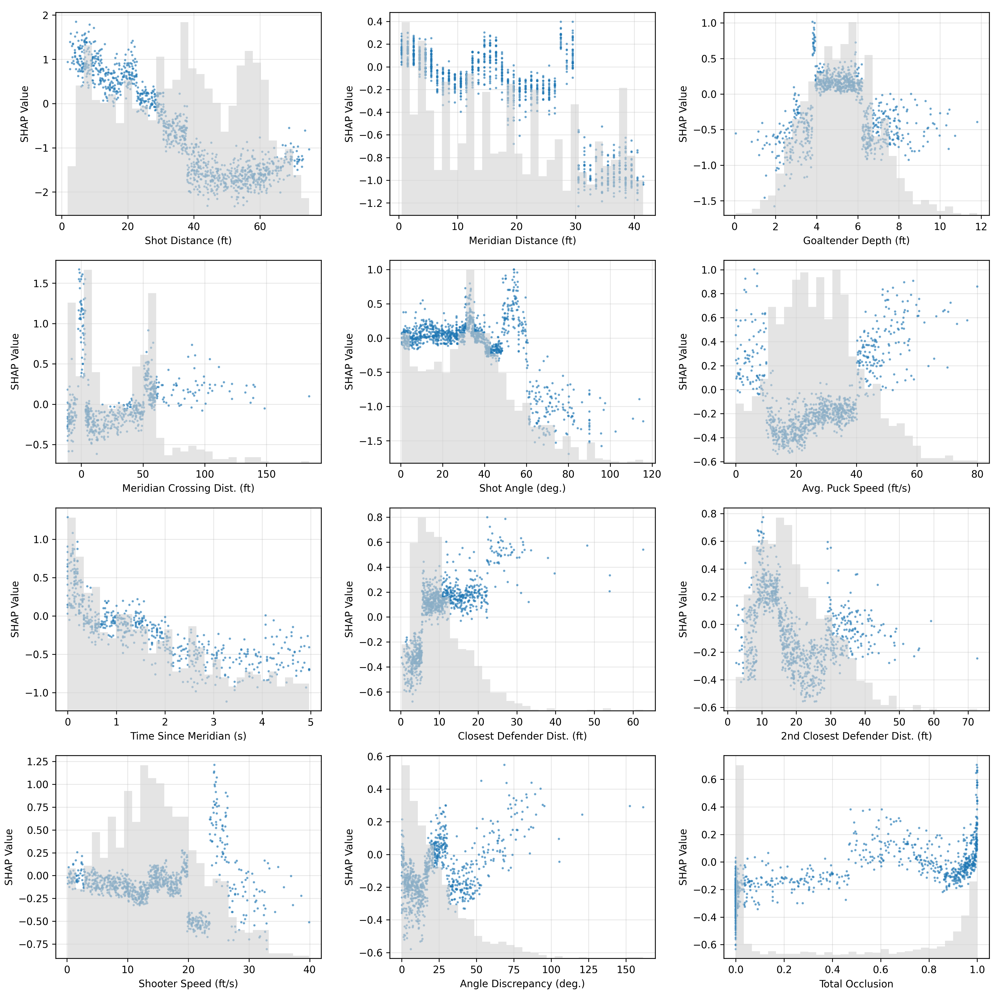

A few patterns stand out from these plots: the closer the shot, the more likely it is to become a goal; the faster the shot, the more likely it is to become a goal; the farther away the defender is from the shot, the more likely it is to become a goal; and the wider the shot angle is, the less likely it is to become a goal.

The meridian features tell a related story: the more time that elapses between the meridian crossing and the shot, the less likely it is to score; the larger the meridian distance, the less likely it is to score; and shots whose meridian crossing happened close to the net are the most likely to score.

The goaltender depth panel adds an interesting pattern. When the goaltender is pinned deep in the net (depth of 2-4 ft) or has positioned far out of it (depth of 6-10 ft), the shot is less likely to score. Finally, the total occlusion panel shows that the heavier the traffic in the shooting lane, the more likely the shot finds the net. Notably, at a total occlusion of 1.0, the SHAP value is the highest.


## Conclusion

In this post, we implement the Feature-Based Expected Goals (xG) Model in Section 2.4 of Jonathan Arsenault's PhD thesis, "Quantitative Analysis of Hockey Using Spatiotemporal Tracking Data". We use the events and tracking data from the 2026 Big Data Cup to compute features such as shot distance, shot speed, traffic, shot angle, meridian time, meridian distance, goaltender depth, and total occlusion. Then, we train an XGBoost model on the modeling dataset with the same hyperparameters as the thesis. 

We find that our metrics fall short of the thesis's due to the dataset size difference, but it still provides valuable insights into factors influencing goal likelihood. Shot distance and meridian distance emerge as the two most important features, and the closer and faster the shot, the more likely it is to become a goal.

Future work will be implementations of later sections of Arsenault's thesis, such as Section 2.5's Graph-Based Approach, in which he trains neural networks to estimate goal likelihood.

A Jupyter notebook of the code is available [here](https://github.com/howardbaik/player-tracking-data/blob/main/feature-based-expected-goals.ipynb).