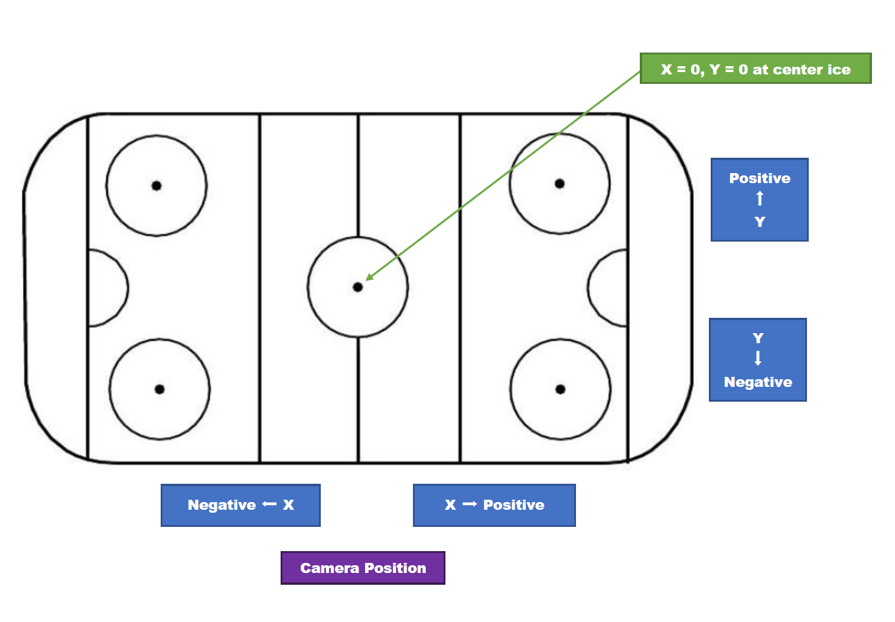
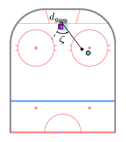

## Introduction

This post is an implementation of the Feature-Based Expected Goals (xG) Model from Section 2.4 of [Jonathan Arsenault](https://www.linkedin.com/in/jonathan-arsenault-a0b414114/)'s [PhD thesis](https://mcgill.scholaris.ca/items/da91938f-30c7-4f75-9ca3-2402a9e5422f). As the thesis puts it, "xG models use a supervised learning algorithm to establish a mapping between a set of features that describe a shot and the probability of the shot resulting in a goal." Here, those features come from event and tracking data and capture shooter motion, pressure from defenders, pre-shot puck movement, and goaltender positioning. We will create each of these features, then train an XGBoost model to predict each shot's probability of becoming a goal.

We will use data from the [Big Data Cup 2026](https://github.com/bigdatacup/Big-Data-Cup-2026), which spans 10 games and combines Stathletes-tracked event data with player tracking data generated from broadcast video.

 All code is written using Claude Opus 4.8 and verified by the author.


### Data Import

We import the data from the Big Data Cup 2026 GitHub repository and tag each events and tracking data with a "Game" id. Then, we convert the clock strings ("MM:SS" / "M:SS") to total seconds for easier comparison and joining between the events and tracking datasets. The tracking data is separated by period (P1/P2/P3/OT), so we concatenate all the tracking files into one dataset of every tracked player-frame across all games and periods.  


```{python}
import polars as pl
from great_tables import GT
import math
import json
import urllib.request, io

# Convert clock strings ("MM:SS" / "M:SS") to total seconds.
# events.Clock uses zero-padded minutes ("09:30"); tracking "Game Clock" is unpadded ("9:30").
# Casting both to integer seconds makes them directly comparable for joins.
def clock_to_seconds(col):
    parts = pl.col(col).str.split(":")
    return (
        parts.list.get(0).cast(pl.Int64) * 60
        + parts.list.get(1).cast(pl.Int64)
    )

# Add the seconds column and slot it right after its source column.
def add_seconds_after(df, src, new):
    df = df.with_columns(clock_to_seconds(src).alias(new))
    cols = [c for c in df.columns if c != new]
    cols.insert(df.get_column_index(src) + 1, new)
    return df.select(cols)

# Every game is read directly from the Big Data Cup 2026 release (no local download).
# Each row is tagged with a "Game" id (the filename stem, e.g. "2025-10-11.Team.A.@.Team.D"),
# identical for a game's Events and Tracking files. That key is required downstream: the
# shots<->tracking joins match on Period + Frame, but Frame is only a per-game counter, so
# without "Game" they would cross-match rows between different games.
_RELEASE_API = "https://api.github.com/repos/bigdatacup/Big-Data-Cup-2026/releases/tags/Data"
_assets = {a["name"]: a["browser_download_url"]
           for a in json.load(urllib.request.urlopen(_RELEASE_API))["assets"]}

def _read_url(url, **kwargs):
    return pl.read_csv(io.BytesIO(urllib.request.urlopen(url).read()), **kwargs)

# Events: one file per game.
event_frames = []
for name, url in _assets.items():
    if not name.endswith(".Events.csv"):
        continue
    game = name[: -len(".Events.csv")]
    df = _read_url(url, schema_overrides={"Player_Id": pl.String, "Player_Id_2": pl.String})
    df = add_seconds_after(df, "Clock", "Clock_Seconds")
    df = df.with_columns(pl.lit(game).alias("Game"))
    event_frames.append(df)
events = pl.concat(event_frames)

# Tracking: P1/P2/P3 (+ POT overtime). ".Tracking_P" excludes Shifts and camera_orientations.
track_frames = []
for name, url in _assets.items():
    if ".Tracking_P" not in name:
        continue
    game = name.split(".Tracking_")[0]
    df = _read_url(url, schema_overrides={"Rink Location Z (Feet)": pl.Float64, "Period": pl.String}).drop("Player Id")
    # Overtime tracking labels Period as "OT"; events use 4 for OT. Normalize to 4 (Int64)
    # so the dtype is consistent across files and OT shots can join their tracking frames.
    df = df.with_columns(pl.col("Period").replace("OT", "4").cast(pl.Int64))
    df = add_seconds_after(df, "Game Clock", "Game_Clock_Seconds")
    df = df.with_columns(pl.lit(game).alias("Game"))
    track_frames.append(df)

# One table of every tracked player-frame across all games and periods.
tracking = pl.concat(track_frames)
```


### Distribution of Shot Types

We look at the distribution of shot types in the events dataset. We filter for `Shot` and `Goal` events and count the number of unique occurences of the `Detail 1` column, which indicates the type of shot taken. We then visualize this distribution using a bar chart.


```{python}
shot_types = (
    events.filter(pl.col("Event").is_in(["Shot", "Goal"]))
    .group_by("Detail_1")
    .agg(pl.len().alias("count"))
    .with_columns((pl.col("count") / pl.col("count").sum()).alias("pct"))
    .sort("count", descending=True)
)


import matplotlib.pyplot as plt

fig, ax = plt.subplots(figsize=(10, 6))

# Create bar chart with percentages
ax.bar(shot_types["Detail_1"], shot_types["pct"] * 100, color="#1f77b4", edgecolor="black", alpha=0.7)

# Customize the plot
ax.set_xlabel("Shot Type", fontsize=12, fontweight="bold")
ax.set_ylabel("Percentage (%)", fontsize=12, fontweight="bold")
ax.set_title("Distribution of Shot Types (Percentage)", fontsize=14, fontweight="bold")

# Rotate x-axis labels for better readability
plt.xticks(rotation=45, ha="right")

# Add percentage labels on top of bars
for i, v in enumerate(shot_types["pct"]):
    ax.text(i, v * 100 + 1, f"{v*100:.1f}%", ha="center", va="bottom", fontsize=8)

plt.tight_layout()
plt.show()
```

The shot type distribution in our dataset is very similar to the thesis's dataset. Table 2.1 from the thesis reveals that Wrist Shots (47.8%) and Snap Shots (25.5%) are the most common, followed by Slap Shots (15.6%) and Deflections (4.5%).


### Distribution of Shot Outcomes

We look at the shot outcomes in the events dataset. We filter for `Shot` and `Goal` events and count the number of unique occurences of the `Detail 2` column, which indicates the outcome of the shot (e.g., On Net, Missed, Blocked).

```{python}
descriptions = {
    "Saved": "The shot is on target and saved by the goaltender.",
    "Goal": "The shot is on target and not saved by the goaltender, resulting in a goal.",
    "Blocked": "The shot is blocked by a skater from the defending team.",
    "Missed": "The shot is not on target.",
}

shot_outcomes = (
    events.filter(pl.col("Event").is_in(["Shot", "Goal"]))
    .with_columns(
        pl.when(pl.col("Event") == "Goal")
        .then(pl.lit("Goal"))
        .when((pl.col("Event") == "Shot") & (pl.col("Detail_2") == "On Net"))
        .then(pl.lit("Saved"))
        .when((pl.col("Event") == "Shot") & (pl.col("Detail_2") == "Blocked"))
        .then(pl.lit("Blocked"))
        .when((pl.col("Event") == "Shot") & (pl.col("Detail_2") == "Missed"))
        .then(pl.lit("Missed"))
        .alias("Outcome")
    )
    .group_by("Outcome")
    .agg(pl.len().alias("count"))
    .with_columns((pl.col("count") / pl.col("count").sum()).alias("pct"))
    .with_columns(pl.col("Outcome").replace(descriptions).alias("Description"))
    .select("Outcome", "Description", "pct")
    .sort("pct", descending=True)
)

(
    GT(shot_outcomes)
    .tab_header(title="Distribution of shot outcomes in the dataset")
    .cols_label(
        Outcome="Shot Outcome",
        Description="Description",
        pct="% of Shots",
    )
    .fmt_percent("pct", decimals=1)
    .cols_width({"Outcome": "130px", "Description": "420px", "pct": "110px"})
)
```


Again, the shot outcome distribution in our dataset is very similar to the thesis's dataset. Table 2.2 shows that the Saved outcome is the most common (48.3%), followed by Blocked (26.0%), Missed (21.4%), and Goal (4.21%). It is perfectly normal for the Goal outcome to be the least common, as goals are rare in hockey.

### Distribution of Shot Location

We look at the distribution of shot locations in the events dataset. We filter for `Shot` and `Goal` events and visualize the distribution of the `X_Coordinate` and `Y_Coordinate` columns on an half-sized ice rink.


## Feature Engineering

TODO: Introduce Feature Engineering of `events` and `tracking` data to extract features for the Features-Based xG Model in the paper.


### Shot Location

TODO: 

### Shooter Motion

To get the shooter's speed at the instant of their shot, we use the `tracking` dataset. First, we filter for the rows where the `tracking` data corresponds to a player (as opposed to the puck). Then, we use the `Image Id` column to extract the frame number. For example, an `Image Id` of `2025-10-11 Team A @ Team D_065468` would correspond to frame number 065468. Then, we order each player's frames in chronological order. Then, we find the x, y distance the player travels over a set frame of 3 frames (approximately 0.1 seconds).  Then, we compute speed using the Euclidean distance and dividing by the elapsed time (~0.1 seconds). Finally, we slot the speed column right after the `Image Id` column for better readability. We name this new dataset `players`.
```{python}
FPS = 30                  # tracking frame rate (frames per second)
SMOOTH_K = 3              # central-difference half-window (~0.1 s each side)
FT_PER_S_TO_MPH = 0.6818  # 1 ft/s = 0.6818 mph
MAX_SPEED_MPH = 30.0      # human skaters peak ~25 mph; above this is a tracking glitch
MAX_SPEED_FPS = MAX_SPEED_MPH / FT_PER_S_TO_MPH

players = (
    tracking
    .filter(pl.col("Player or Puck") == "Player")
    .with_columns(
        # Numeric frame index from the Image Id suffix, and jersey as a string for matching.
        pl.col("Image Id").str.split("_").list.last().cast(pl.Int64).alias("Frame"),
        pl.col("Player Jersey Number").cast(pl.String).alias("Jersey"),
    )
    # Drop rows whose jersey couldn't be read: they'd all collapse into one bogus "null"
    # track, and differencing positions of *different* players invents huge fake speeds.
    .filter(pl.col("Jersey").is_not_null())
    # Order each player's frames in time so shift() walks consecutive samples.
    .sort(["Game", "Period", "Team", "Jersey", "Frame"])
    .with_columns(
        # Central difference over +/- SMOOTH_K frames, partitioned per player-period.
        (pl.col("Rink Location X (Feet)").shift(-SMOOTH_K) - pl.col("Rink Location X (Feet)").shift(SMOOTH_K))
            .over(["Game", "Period", "Team", "Jersey"]).alias("dx"),
        (pl.col("Rink Location Y (Feet)").shift(-SMOOTH_K) - pl.col("Rink Location Y (Feet)").shift(SMOOTH_K))
            .over(["Game", "Period", "Team", "Jersey"]).alias("dy"),
        (pl.col("Frame").shift(-SMOOTH_K) - pl.col("Frame").shift(SMOOTH_K))
            .over(["Game", "Period", "Team", "Jersey"]).alias("dframe"),
    )
    .with_columns(
        # dt = frames / fps (seconds); speed = displacement / dt, in feet per second.
        ((pl.col("dx") ** 2 + pl.col("dy") ** 2).sqrt() / (pl.col("dframe") / FPS)).alias("speed_fps")
    )
    .with_columns(
        # Null out physically impossible speeds (tracking ID-swaps / position jumps) so
        # they don't poison the per-shot pick or its fallback median.
        pl.when(pl.col("speed_fps") <= MAX_SPEED_FPS).then(pl.col("speed_fps")).otherwise(None).alias("speed_fps")
    )
    .with_columns(
        (pl.col("speed_fps") * FT_PER_S_TO_MPH).alias("speed_mph")
    )
)
```

Then, from the `events` dataset, we filter for Shot and Goal events and mutate a column for the shot id, the unique identifier for each shot in the dataset. We call this new dataset `shots`.

Then, we left join the `players` dataset on the `shots` dataset. Among the shooter's tracking frames within 1 second of the shot, we filter for the frame closest to the shot time and extract the shooter's speed at the time of the shot. We get the speed in both mph (miles per hour) and fps (feet per second).

```{python}
shots = (
    events.filter(pl.col("Event").is_in(["Shot", "Goal"]))
    .with_columns(
        pl.when(pl.col("Team") == pl.col("Home_Team")).then(pl.lit("Home"))
          .otherwise(pl.lit("Away")).alias("Track_Team")
    )
    .with_row_index("shot_id")
)

# Candidate shooter frames: same player, within the event second (+/-1s), valid position.
cand = (
    shots.join(
        players.select([
            "Game", "Period", "Team", "Jersey", "Game_Clock_Seconds", "Frame",
            "Rink Location X (Feet)", "Rink Location Y (Feet)", "speed_fps",
        ]),
        left_on=["Game", "Period", "Track_Team", "Player_Id"],
        right_on=["Game", "Period", "Team", "Jersey"], how="left",
    )
    .filter((pl.col("Game_Clock_Seconds") - pl.col("Clock_Seconds")).abs() <= 1)
    .filter(pl.col("Rink Location X (Feet)").is_not_null()
            & pl.col("Rink Location Y (Feet)").is_not_null())
    .with_columns(
        ((pl.col("Rink Location X (Feet)") - pl.col("X_Coordinate")) ** 2
         + (pl.col("Rink Location Y (Feet)") - pl.col("Y_Coordinate")) ** 2).sqrt().alias("d_direct"),
        ((pl.col("Rink Location X (Feet)") + pl.col("X_Coordinate")) ** 2
         + (pl.col("Rink Location Y (Feet)") + pl.col("Y_Coordinate")) ** 2).sqrt().alias("d_flip"),
    )
    .with_columns(
        pl.min_horizontal("d_direct", "d_flip").alias("match_dist"),
        (pl.col("d_flip") < pl.col("d_direct")).alias("used_flip"),
    )
)

# Release frame = the candidate closest to the release point (nulls_last so a real
# match is never beaten by a missing distance).
release = (
    cand.sort("match_dist", nulls_last=True)
    .group_by("shot_id", maintain_order=True)
    .first()
    .select(["shot_id", "Frame", "match_dist", "used_flip", "speed_fps"])
)

# Fallback: representative speed over the whole event-second window.
window_med = cand.group_by("shot_id").agg(
    pl.col("speed_fps").median().alias("speed_fps_window_median"),
    pl.len().alias("n_candidates"),
)

# A match is trusted when the closest frame is within ~10 ft and has a defined speed;
# otherwise fall back to the window median (flagged), or mark no tracking at all.
MAX_MATCH_DIST = 10.0
shot_speeds = (
    shots.join(release, on="shot_id", how="left")
    .join(window_med, on="shot_id", how="left")
    .with_columns(
        pl.when((pl.col("match_dist") <= MAX_MATCH_DIST) & pl.col("speed_fps").is_not_null())
          .then(pl.col("speed_fps"))
          .otherwise(pl.col("speed_fps_window_median"))
          .alias("shooter_speed_fps"),
        pl.when((pl.col("match_dist") <= MAX_MATCH_DIST) & pl.col("speed_fps").is_not_null())
          .then(pl.lit("matched"))
          .when(pl.col("speed_fps_window_median").is_not_null())
          .then(pl.lit("fallback_window_median"))
          .otherwise(pl.lit("no_tracking"))
          .alias("match_quality"),
    )
    .with_columns((pl.col("shooter_speed_fps") * 0.6818).alias("shooter_speed_mph"))
    .sort(["Period", "Clock_Seconds"], descending=[False, True])
)
```


### Pressure

Pressure is defined as the distance from the shot location to the closest and second-closest defending skater. According to the paper, a continuous distance is more descriptive than counting defenders within 6 ft, and adding the second-closest
defender captures pressure from multiple defenders.

We join the shots dataset to every defending skater and measure the distance between the defender and the shot. We filter for the closest and second-closest defender to find the distance from the shot location to the closest and second closest defenders.

```{python}
# Defending skaters only: opposite tracking team, real jersey numbers, no goalies.
defenders = (
    players
    .filter(pl.col("Jersey") != "Go")
    .select([
        "Game", "Period", "Team", "Frame",
        "Rink Location X (Feet)", "Rink Location Y (Feet)",
    ])
)

# Per shot: the defending team, the release frame, and the shot location in tracking
# coordinates (negated when the release match used the flip).
shot_frames = (
    shots
    .join(release.select(["shot_id", "Frame", "used_flip"]), on="shot_id", how="left")
    .with_columns(
        pl.when(pl.col("Track_Team") == "Home").then(pl.lit("Away"))
          .otherwise(pl.lit("Home")).alias("Def_Team"),
        pl.when(pl.col("used_flip")).then(-pl.col("X_Coordinate"))
          .otherwise(pl.col("X_Coordinate")).alias("Shot_X"),
        pl.when(pl.col("used_flip")).then(-pl.col("Y_Coordinate"))
          .otherwise(pl.col("Y_Coordinate")).alias("Shot_Y"),
    )
    .select(["shot_id", "Game", "Period", "Def_Team", "Frame", "Shot_X", "Shot_Y"])
)

# Join each shot to every defending skater in its release frame; measure distance.
pressure = (
    shot_frames
    .join(
        defenders,
        left_on=["Game", "Period", "Def_Team", "Frame"],
        right_on=["Game", "Period", "Team", "Frame"],
        how="left",
    )
    .with_columns(
        ((pl.col("Rink Location X (Feet)") - pl.col("Shot_X")) ** 2
         + (pl.col("Rink Location Y (Feet)") - pl.col("Shot_Y")) ** 2)
        .sqrt().alias("def_dist")
    )
    .group_by("shot_id", maintain_order=True)
    .agg(
        pl.col("def_dist").sort(nulls_last=True).alias("def_dists"),
        pl.col("def_dist").is_not_null().sum().alias("n_defenders"),
    )
    .with_columns(
        pl.col("def_dists").list.get(0, null_on_oob=True).alias("closest_def_dist"),
        pl.col("def_dists").list.get(1, null_on_oob=True).alias("second_closest_def_dist"),
    )
    .drop("def_dists")
)

# Attach to the shots table for use as expected-goals model features.
shot_pressure = shots.join(pressure, on="shot_id", how="left").select(
    "Period", "Clock", "Team", "Player_Id", "Event", "Detail_1",
    "n_defenders", "closest_def_dist", "second_closest_def_dist",
)
```


### Pre-Shot Movement

Rink Coordinates:

{width=80% fig-align="center"}


Pre-shot movement features, focused on lateral puck movement (east-west):

1. time_since_meridian  -- seconds since the puck last crossed the meridian
2. meridian_cross_dist  -- where it crossed, as distance to the goal line
3. avg_puck_speed       -- average puck speed in the 1 s before the shot

The "meridian" is the Y = 0 line running net-to-net down the center of the ice; the
puck crosses it when its Y coordinate changes sign (lateral / east-west movement, 
which forces the goalie across and raises shot danger). Features 1 and 2 are only defined when the crossing happened within 5 s before the shot.

```{python}
# The puck moves far faster than skaters, so the 30 mph skater cap doesn't apply; we
# only drop physically impossible jumps (tracking glitches) above ~110 mph.
MAX_PUCK_SPEED_MPH = 110.0
MAX_PUCK_SPEED_FPS = MAX_PUCK_SPEED_MPH / FT_PER_S_TO_MPH

puck = (
    tracking
    .filter(pl.col("Player or Puck") == "Puck")
    .filter(pl.col("Rink Location X (Feet)").is_not_null())
    .with_columns(
        pl.col("Image Id").str.split("_").list.last().cast(pl.Int64).alias("Frame")
    )
    .sort(["Game", "Period", "Frame"])
    .with_columns(
        (pl.col("Rink Location X (Feet)").shift(-SMOOTH_K) - pl.col("Rink Location X (Feet)").shift(SMOOTH_K)).over(["Game", "Period"]).alias("dx"),
        (pl.col("Rink Location Y (Feet)").shift(-SMOOTH_K) - pl.col("Rink Location Y (Feet)").shift(SMOOTH_K)).over(["Game", "Period"]).alias("dy"),
        (pl.col("Frame").shift(-SMOOTH_K) - pl.col("Frame").shift(SMOOTH_K)).over(["Game", "Period"]).alias("dframe"),
    )
    .with_columns(
        ((pl.col("dx") ** 2 + pl.col("dy") ** 2).sqrt() / (pl.col("dframe") / FPS)).alias("puck_speed_fps")
    )
    .with_columns(
        pl.when(pl.col("puck_speed_fps") <= MAX_PUCK_SPEED_FPS).then(pl.col("puck_speed_fps")).otherwise(None).alias("puck_speed_fps")
    )
    .select(["Game", "Period", "Frame", "Rink Location X (Feet)", "Rink Location Y (Feet)", "puck_speed_fps"])
    .rename({"Rink Location X (Feet)": "puck_x", "Rink Location Y (Feet)": "puck_y"})
)

# Per-shot orientation: the shot location in tracking coords (negated when the release
# match used the flip) tells us which goal line the team attacks (+89 if X > 0).
shot_orient = (
    shots.join(release.select(["shot_id", "Frame", "used_flip"]), on="shot_id", how="left")
    .with_columns(
        pl.when(pl.col("used_flip")).then(-pl.col("X_Coordinate")).otherwise(pl.col("X_Coordinate")).alias("Shot_X_track")
    )
    .with_columns((pl.col("Shot_X_track") > 0).alias("attack_right"))
    .select(["shot_id", "Game", "Period", "Frame", "attack_right"])
    .rename({"Frame": "shot_frame"})
)

# Puck samples in the same period within 5 s (150 frames) before each shot, with
# coordinates normalized to attack-right. (The meridian sign-change is invariant to the
# flip; normalizing X only matters for the goal-line distance.)
window = (
    shot_orient.join(puck, on=["Game", "Period"], how="left")
    .filter((pl.col("shot_frame") - pl.col("Frame")).is_between(0, 5 * FPS))
    .with_columns(
        pl.when(pl.col("attack_right")).then(pl.col("puck_x")).otherwise(-pl.col("puck_x")).alias("px"),
        pl.when(pl.col("attack_right")).then(pl.col("puck_y")).otherwise(-pl.col("puck_y")).alias("py"),
    )
    .sort(["shot_id", "Frame"])
)

# Feature 3: average puck speed over the 1 s (30 frames) before the shot.
avg_speed = (
    window.filter((pl.col("shot_frame") - pl.col("Frame")).is_between(0, 1 * FPS))
    .group_by("shot_id")
    .agg(pl.col("puck_speed_fps").mean().alias("avg_puck_speed_fps"))
    .with_columns((pl.col("avg_puck_speed_fps") * FT_PER_S_TO_MPH).alias("avg_puck_speed_mph"))
)

# Features 1 & 2: the most recent meridian crossing within the 5 s window. A crossing is
# a sign change in py between consecutive frames; we linearly interpolate the X where
# py = 0, then keep the latest crossing (largest Frame) before the shot.
crossings = (
    window.with_columns(
        pl.col("px").shift(1).over("shot_id").alias("px_prev"),
        pl.col("py").shift(1).over("shot_id").alias("py_prev"),
    )
    .filter(pl.col("py_prev").is_not_null() & (pl.col("py_prev") * pl.col("py") < 0))
    .with_columns(
        (pl.col("px_prev") + (pl.col("px") - pl.col("px_prev")) * (0 - pl.col("py_prev")) / (pl.col("py") - pl.col("py_prev"))).alias("x_cross")
    )
    .sort(["shot_id", "Frame"])
    .group_by("shot_id", maintain_order=True)
    .last()
    .with_columns(
        ((pl.col("shot_frame") - pl.col("Frame")) / FPS).alias("time_since_meridian"),
        (89 - pl.col("x_cross")).alias("meridian_cross_dist"),  # negative if crossed behind the net
    )
    .select(["shot_id", "time_since_meridian", "meridian_cross_dist"])
)

# Attach to the shots table; nulls mark shots with no meridian crossing in the prior 5 s.
pre_shot_movement = (
    shots.join(crossings, on="shot_id", how="left")
    .join(avg_speed, on="shot_id", how="left")
    .sort(["Period", "Clock_Seconds"], descending=[False, True])
    .select(
        "Period", "Clock", "Team", "Player_Id", "Event", "Detail_1",
        "time_since_meridian", "meridian_cross_dist", "avg_puck_speed_fps", "avg_puck_speed_mph",
    )
)
```

Feature 3:
For every shot, join in all puck tracking samples from the same period within 5 seconds (150 frames) before the shot. Average puck speed over the 1 second (30 frames) before the shot. Captures how fast the puck was moving into the shot.

Features 1 and 2:
Finds the most recent meridian crossing within the 5 s window. A crossing is a moment when the puck crosses the center line of the rink. We'll identify this by checking when the puck's y-coordinate changes sign (from positive to negative or vice versa) within the 5-second window before the shot.

`time_since_meridian = (shot_frame − Frame) / FPS` gives us the time in seconds since the puck last crossed the meridian before the shot was taken. 
`meridian_cross_dist = 89 − x_cross` is calculated as the distance from where the puck crossed the meridian to the goal line (89 feet), with negative values indicating crossings behind the net.

### Traffic

We model "traffic" by projecting each skater onto the goal line via a straight line from the shooter, then summing the Gaussian-weighted coverage of the 6-ft goal face (y ∈ [−3, 3]).

```{python}
import numpy as np

SIGMA = 1.5  # Gaussian standard deviation (feet)
GOAL_HALF = 3.0  # half-width of goal face (feet)


def _normal_cdf_batched(x: np.ndarray) -> np.ndarray:
    """Vectorised normal CDF using math.erf identity: Φ(z) = 0.5*(1+erf(z/√2))."""
    return 0.5 * (1.0 + np.vectorize(math.erf)(x / math.sqrt(2)))


# --- Per-shot info in tracking coordinates (reuses release match) ---
shot_info = (
    shots.join(release.select(["shot_id", "Frame", "used_flip"]), on="shot_id", how="left")
    .with_columns(
        # Shot location in tracking coords
        pl.when(pl.col("used_flip")).then(-pl.col("X_Coordinate")).otherwise(pl.col("X_Coordinate")).alias("Shot_X"),
        pl.when(pl.col("used_flip")).then(-pl.col("Y_Coordinate")).otherwise(pl.col("Y_Coordinate")).alias("Shot_Y"),
    )
    .with_columns(
        # Goal line: +89 if attacking right, −89 if attacking left
        pl.when(pl.col("Shot_X") > 0).then(pl.lit(89.0)).otherwise(pl.lit(-89.0)).alias("goal_x"),
    )
    .select(["shot_id", "Game", "Period", "Frame", "Track_Team", "Player_Id", "Shot_X", "Shot_Y", "goal_x"])
)

# --- All non-goalie skaters at each shot's release frame ---
skaters_at_frame = (
    players
    .filter(pl.col("Jersey") != "Go")
    .select(["Game", "Period", "Team", "Jersey", "Frame",
             "Rink Location X (Feet)", "Rink Location Y (Feet)"])
    .rename({"Rink Location X (Feet)": "sk_x", "Rink Location Y (Feet)": "sk_y"})
)

# Join each shot with every skater present at the release frame, then drop the shooter.
occlusion_pairs = (
    shot_info.join(
        skaters_at_frame,
        left_on=["Game", "Period", "Frame"],
        right_on=["Game", "Period", "Frame"],
        how="left",
    )
    # Exclude the shooter (same team in tracking namespace + same jersey)
    .filter(
        ~((pl.col("Track_Team") == pl.col("Team")) & (pl.col("Player_Id") == pl.col("Jersey")))
    )
    .filter(pl.col("sk_x").is_not_null() & pl.col("sk_y").is_not_null())
    # Compute y-intercept on the goal line
    .with_columns(
        (pl.col("Shot_Y")
         + (pl.col("sk_y") - pl.col("Shot_Y"))
           * (pl.col("goal_x") - pl.col("Shot_X"))
           / (pl.col("sk_x") - pl.col("Shot_X"))
        ).alias("y_goal")
    )
    # Drop degenerate cases: skater at same x as shooter, or intercept is undefined
    .filter(pl.col("y_goal").is_not_null() & pl.col("y_goal").is_finite())
)

# Compute Gaussian contribution per skater via map_batches
occlusion_pairs = occlusion_pairs.with_columns(
    pl.struct(["y_goal"]).map_batches(
        lambda s: pl.Series(
            _normal_cdf_batched((GOAL_HALF - s.struct.field("y_goal").to_numpy()) / SIGMA)
            - _normal_cdf_batched((-GOAL_HALF - s.struct.field("y_goal").to_numpy()) / SIGMA)
        ),
        return_dtype=pl.Float64,
    ).alias("occlusion_contribution")
)

# Sum per shot
total_occlusion = (
    occlusion_pairs
    .group_by("shot_id", maintain_order=True)
    .agg(pl.col("occlusion_contribution").sum().alias("total_occlusion"))
)

shot_occlusion = (
    shots.join(total_occlusion, on="shot_id", how="left")
    .select(
        "Period", "Clock", "Team", "Player_Id", "Event", "Detail_1",
        "X_Coordinate", "Y_Coordinate", "total_occlusion",
    )
)
```


### Goaltender Positioning

{fig-align="center"}

Figure shows goaltender angle $\zeta$ and depth $d_g$ relative to the goal center, defined as the point on the goal line equidistant from the posts. 

Angle Discrepancy:
$$\zeta = \arccos!\left(\frac{s \cdot g}{|s|,|g|}\right)\times\frac{180}{\pi}$$

Angle between the line to the shooter and the line to the goaltender, in degrees. A well-positioned goalie should be close to 0° (in line with the shooter and goal center); a goalie caught out of position will have a larger angle.

Goaltender Depth: Straight-line distance from the goaltender to the goal center, i.e. how far out of the crease the goalie has come.

```{python}
# Per shot: defending team, release frame, shot location in tracking coords, goal center.
shot_goalie_ctx = (
    shots.join(release.select(["shot_id", "Frame", "used_flip"]), on="shot_id", how="left")
    .with_columns(
        pl.when(pl.col("Track_Team") == "Home").then(pl.lit("Away"))
          .otherwise(pl.lit("Home")).alias("Def_Team"),
        pl.when(pl.col("used_flip")).then(-pl.col("X_Coordinate"))
          .otherwise(pl.col("X_Coordinate")).alias("Shot_X"),
        pl.when(pl.col("used_flip")).then(-pl.col("Y_Coordinate"))
          .otherwise(pl.col("Y_Coordinate")).alias("Shot_Y"),
    )
    .with_columns(
        # Goal line: +89 if attacking right, −89 if attacking left.
        pl.when(pl.col("Shot_X") > 0).then(pl.lit(89.0)).otherwise(pl.lit(-89.0)).alias("goal_x"),
    )
    .select(["shot_id", "Game", "Period", "Def_Team", "Frame", "Shot_X", "Shot_Y", "goal_x"])
)

# Defending goaltender's tracked position at each shot's release frame.
goalies = (
    players
    .filter(pl.col("Jersey") == "Go")
    .select(["Game", "Period", "Team", "Frame",
             "Rink Location X (Feet)", "Rink Location Y (Feet)"])
    .rename({"Rink Location X (Feet)": "goalie_x", "Rink Location Y (Feet)": "goalie_y"})
)

goaltender_positioning = (
    shot_goalie_ctx
    .join(
        goalies,
        left_on=["Game", "Period", "Def_Team", "Frame"],
        right_on=["Game", "Period", "Team", "Frame"],
        how="left",
    )
    # One goalie per team-frame is expected; guard against duplicate tracks.
    .group_by("shot_id", maintain_order=True)
    .first()
    .with_columns(
        # Vectors from the goal center to the shooter and to the goalie.
        (pl.col("Shot_X") - pl.col("goal_x")).alias("s_x"),
        pl.col("Shot_Y").alias("s_y"),
        (pl.col("goalie_x") - pl.col("goal_x")).alias("g_x"),
        pl.col("goalie_y").alias("g_y"),
    )
    .with_columns(
        (pl.col("s_x") ** 2 + pl.col("s_y") ** 2).sqrt().alias("s_mag"),
        (pl.col("g_x") ** 2 + pl.col("g_y") ** 2).sqrt().alias("g_mag"),
        (pl.col("s_x") * pl.col("g_x") + pl.col("s_y") * pl.col("g_y")).alias("dot"),
    )
    .with_columns(
        # d_g: distance from the goaltender to the goal center.
        pl.col("g_mag").alias("goaltender_depth"),
        # ζ (degrees): undefined when shooter or goalie sits exactly at the goal center.
        pl.when((pl.col("s_mag") > 0) & (pl.col("g_mag") > 0))
          .then(
              (pl.col("dot") / (pl.col("s_mag") * pl.col("g_mag")))
              .clip(-1.0, 1.0).arccos() * (180 / math.pi)
          )
          .otherwise(None)
          .alias("angle_discrepancy"),
    )
    .select(["shot_id", "angle_discrepancy", "goaltender_depth"])
)

# Attach to the shots table for use as expected-goals model features.
shot_goaltender = (
    shots.join(goaltender_positioning, on="shot_id", how="left")
    .sort(["Period", "Clock_Seconds"], descending=[False, True])
    .select(
        "Period", "Clock", "Team", "Player_Id", "Event", "Detail_1",
        "angle_discrepancy", "goaltender_depth",
    )
)
```


### Extra Stuff

So (shot_frame - Frame) / FPS is "how long ago, in seconds, did the puck last cross the center line before this shot was taken." It's the same frames→seconds conversion used elsewhere in the notebook (e.g. the dframe / FPS term in the speed formula); 
